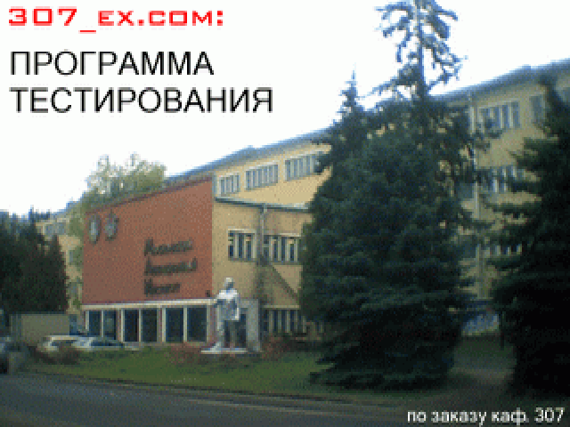

### Лопни мои глаза, что это?

Исходник теста по экологии для 307 кафедры МАИ (circa 2002).

Больше известен как `307_ex.com`, вот [боль студентов][1] связанная с этим
тестом.

Добровольно принудительно писал это вместо курсовой работы с паяльником и
зачета.  Надеюсь сейчас в МАИ не осталось компьютеров на которых он был мог
запуститься, все таки 2019 год на дворе и работающие 286 комплюктеры удел
музеев и фанатов прекрасного.

В качестве бонуса - при старте теста выводится фотография трешки сделанная на
цифровую мыльницу в 2002 году (файл `307_EX.RAW` это PCX).

### Требования
Могу ошибиться с требованиями, давно это было:

* Процессор: 80286+ (да, на 8086 не запустится, для вычисления времени
  мне почему-то нехватило 16 бит)
* Для запуска нужен DOS 3.2+

### Компиляция

В репозиторий не включены проприетарные программы, но, наверное, их можно
найти в интернетах:
* `TURBOBAT.EXE` – [компилятор `*.bat` файлов][2];
* `P.EXE` - компрессор `*.com` и  `*.exe` файлов.  Для замены подойдет
  какой-нибудь старый UPX, [DIET][4] либо [PKLITE][3];
* `$PIRIT.COM` - Night $pirit - polymorphic file encryptor.  Его будет сложно
  найти, все должно работать и без него.  Его обычно классифицируют как
  malware, но мне кажется это перебор - это всего лишь инструмент.  Если
  непреодолимое желание найти переборет вашу лень, то на многих BBS он
  проходил в списках как "Night $pirit's Polymorphic Executable File
  Encryptor"

Так как же компилировать-то?

* Компилировать с помощью TASM 2.0+
* Кодировка исходников: 866

### Unittests

Шта?

### English, motherfucker!  Do you speak it?

Я не знаю зачем я делал ENGLISH версию, наверное было не чем заняться.

### Source snapshot

[1]:http://forum.mai.exler.ru/?s=372984dfb5df0e4d05e1968ebdc0f2c5&topic=6740
[2]:https://archive.org/details/TBT321_ZIP
[3]:http://www.dcee.net/Files/Archiver/pklte150.exe
[4]:http://www.dcee.net/Files/Archiver/diet144.arj